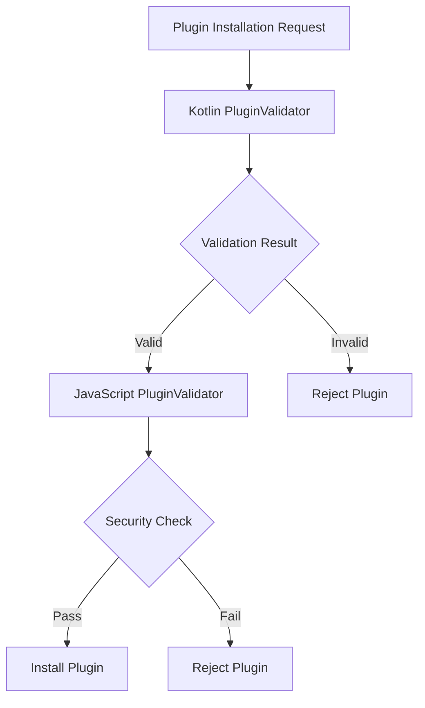

# Mr.Comic Feature Implementation Plan

## 1. Overview

This document outlines the implementation plan for enhancing the Mr.Comic application with the requested features. After analyzing the existing codebase, we've identified that many features are already partially or fully implemented. This plan focuses on completing and enhancing these features to meet all requirements.

## 2. Current State Analysis

### 2.1 Project Architecture
The Mr.Comic project follows a modular Android architecture with clean separation of concerns:

- **Core modules** (`core-*`): Shared infrastructure (data, domain, models, UI components, analytics)
- **Feature modules** (`feature-*`): Self-contained features (library, reader, settings, OCR, themes, plugins)
- **App module**: Main application that composes all features
- **Plugin system**: Comprehensive plugin architecture with JavaScript support
- **Dictionaries**: Offline dictionary support for translation and OCR

### 2.2 Implemented Features Status

#### 2.2.1 Offline Dictionary Support
✅ **Status**: Fully implemented with comprehensive support

**Existing Implementation**:
- Multiple dictionary files (en-ru, manga-sfx, OCR dictionaries)
- Enhanced text processing pipeline
- Language detection capabilities
- Translation quality metrics

#### 2.2.2 Plugin System
✅ **Status**: Fully implemented with all core components

**Existing Implementation**:
- JavaScript plugin support with sandboxed execution
- Comprehensive permission management
- Plugin validation and security features
- Multiple plugin types (OCR, Translator, FileFormat, Theme, UI Extension)
- Plugin lifecycle management

#### 2.2.3 Comic Reader
✅ **Status**: Implemented with basic functionality

**Existing Implementation**:
- Support for multiple formats (CBZ, CBR, PDF)
- Zoom and pan capabilities
- Optimization for large files
- Memory management for efficient rendering

## 3. Required Enhancements

Based on the analysis, we need to enhance and complete the following areas:

### 3.1 PluginValidator Integration
**Status**: Partially implemented - Needs integration

**Enhancement Requirements**:
- Integrate JavaScript PluginValidator with Android PluginManager
- Add signature verification
- Implement malware detection capabilities
- Create unified validation interface

### 3.2 Plugin Permission System Completion
**Status**: Implemented but incomplete

**Enhancement Requirements**:
- Complete all TODO permission checks in AndroidPluginBridge
- Add permission request UI
- Implement permission persistence
- Add granular permission controls

### 3.3 Plugin API Enhancement
**Status**: Basic implementation exists

**Enhancement Requirements**:
- Extend API with more application integration points
- Add comic and page manipulation capabilities
- Implement data storage and retrieval methods
- Add UI modification capabilities

### 3.4 Reader Zoom and Pan Enhancement
**Status**: Implemented with basic functionality

**Enhancement Requirements**:
- Add smooth zoom animations
- Implement zoom presets (fit, fill, 100%, 200%, etc.)
- Add pan boundaries and constraints
- Implement gesture recognition improvements

### 3.5 Large File Support Enhancement
**Status**: Implemented with sophisticated optimization

**Enhancement Requirements**:
- Add more adaptive loading strategies
- Improve memory pressure handling
- Implement progressive image loading
- Add cache management based on device capabilities

## 4. Detailed Implementation Plan

### 4.1 PluginValidator Integration

The PluginValidator is implemented in both JavaScript (`plugins/core/PluginValidator.js`) and Kotlin (`android/feature-plugins/src/main/java/com/example/feature/plugins/domain/PluginValidator.kt`) but needs integration.

#### 4.1.1 Integration Approach



#### 4.1.2 Implementation Steps
1. Create bridge between JavaScript and Kotlin validators
2. Implement unified validation interface
3. Add signature verification
4. Implement malware detection
5. Add validation result caching

#### 4.1.3 Implementation Details

The integration will involve creating a unified validation service that combines both validators:

```kotlin
class UnifiedPluginValidator @Inject constructor(
    private val kotlinValidator: PluginValidator,
    private val javascriptValidator: JavaScriptPluginValidator
) {
    suspend fun validatePlugin(pluginPath: String): ValidationResult {
        // First validate with Kotlin validator
        val kotlinResult = kotlinValidator.validatePackage(pluginPath)
        if (!kotlinResult.success) {
            return ValidationResult(false, "Kotlin validation failed: ${kotlinResult.error}")
        }
        
        // Then validate with JavaScript validator
        val jsResult = javascriptValidator.validatePlugin(pluginPath)
        if (!jsResult.isValid) {
            return ValidationResult(false, "JavaScript validation failed: ${jsResult.errorMessage}")
        }
        
        return ValidationResult(true, "Plugin validation successful")
    }
}

data class ValidationResult(
    val success: Boolean,
    val message: String
)
```

#### 4.1.4 Signature Verification

To implement signature verification, we'll add a method to check digital signatures of plugin packages:

```kotlin
fun verifyPluginSignature(pluginPath: String, expectedSignature: String): Boolean {
    val file = File(pluginPath)
    val actualSignature = calculateFileHash(file)
    return actualSignature == expectedSignature
}

private fun calculateFileHash(file: File): String {
    return try {
        val digest = MessageDigest.getInstance("SHA-256")
        val bytes = file.readBytes()
        val hashBytes = digest.digest(bytes)
        hashBytes.joinToString("") { "%02x".format(it) }
    } catch (e: Exception) {
        ""
    }
}
```

#### 4.1.5 Malware Detection

For malware detection, we'll enhance the existing security checks:

```kotlin
fun checkForMaliciousCode(code: String): PluginResult<Unit> {
    // Extended list of malicious patterns
    val maliciousPatterns = listOf(
        "eval\\s*\\(\\s*['\"`]\\s*.*?\\s*['\"`]\\s*\\)",
        "Function\\s*\\(\\s*['\"`].*?['\"`]\\s*,\\s*['\"`].*?['\"`]\\s*\\)",
        "setTimeout\\s*\\(\\s*['\"`].*?['\"`]\\s*,\\s*\\d+\\s*\\)",
        "setInterval\\s*\\(\\s*['\"`].*?['\"`]\\s*,\\s*\\d+\\s*\\)",
        // Android-specific malicious patterns
        "Runtime\\.getRuntime\\(\\)\\.exec\\(",
        "System\\.loadLibrary\\(",
        "ActivityManager",
        "PackageManager"
    )
    
    for (pattern in maliciousPatterns) {
        val regex = Regex(pattern, RegexOption.IGNORE_CASE)
        if (regex.containsMatchIn(code)) {
            return PluginResult.error("Potentially malicious code detected: $pattern")
        }
    }
    
    return PluginResult.success(Unit)
}
```

### 4.2 Permission System Completion

The permission system has incomplete checks marked as TODO in `AndroidPluginBridge.java`.

#### 4.2.1 Missing Permission Checks
- `settingsGet` - Проверка разрешений 'read_settings'
- `settingsSet` - Проверка разрешений 'write_settings'
- `settingsRemove` - Проверка разрешений 'write_settings'
- `fsReadFile` - Проверка 'read_file'
- `fsWriteFile` - Проверка 'write_file'
- `fsExists` - Проверка 'read_file'
- `imageGetImage` - Проверка разрешения 'read_image'
- `textGetText` - Проверка разрешения 'read_text'
- `textSetText` - Проверка разрешения 'write_text'

#### 4.2.2 Implementation Steps
1. Implement all TODO permission checks using existing `PluginPermissionManager`
2. Add permission request UI in PluginsScreen
3. Implement permission persistence using SharedPreferences
4. Add granular permission controls for different file paths

#### 4.2.3 Implementation Example

```java
// Example implementation for settingsGet permission check
@JavascriptInterface
public void settingsGet(String pluginIdFromJs, String key, String defaultValueJson, String callbackId) {
    Log.d(TAG_PREFIX + pluginId, "settingsGet called for key: " + key + " with callbackId: " + callbackId);
    if (!this.pluginId.equals(pluginIdFromJs)) {
        runJsCallback(callbackId, false, createErrorJson("permission_denied", "Plugin ID mismatch."));
        return;
    }
    
    // Check for read_settings permission
    if (!pluginPermissionManager.hasPermission(pluginId, PluginPermission.SYSTEM_SETTINGS)) {
        runJsCallback(callbackId, false, createErrorJson("permission_denied", "Missing read_settings permission."));
        return;
    }
    
    try {
        SharedPreferences prefs = getPluginPreferences();
        String valueJson = prefs.getString(key, defaultValueJson);
        runJsCallback(callbackId, true, valueJson);
    } catch (Exception e) {
        Log.e(TAG_PREFIX + pluginId, "Error in settingsGet for key " + key, e);
        runJsCallback(callbackId, false, createErrorJson("native_error", e.getMessage()));
    }
}
```

#### 4.2.4 Permission Request UI

The permission request UI already exists in `PluginsScreen.kt` as `PermissionRequestDialog`. We need to enhance it to handle more granular permissions and provide better user feedback.

```kotlin
@Composable
private fun PermissionRequestDialog(
    pluginId: String,
    permissions: List<PluginPermission>,
    onGranted: (String, List<PluginPermission>) -> Unit,
    onDenied: (String) -> Unit,
    onDismiss: () -> Unit
) {
    AlertDialog(
        onDismissRequest = onDismiss,
        title = { Text("Permission Request") },
        text = {
            Column {
                Text("Plugin requests the following permissions:")
                Spacer(modifier = Modifier.height(8.dp))
                
                permissions.forEach { permission ->
                    Row(
                        modifier = Modifier.padding(vertical = 4.dp),
                        verticalAlignment = Alignment.CenterVertically
                    ) {
                        Icon(
                            imageVector = getPermissionIcon(permission),
                            contentDescription = null,
                            tint = getPermissionColor(permission),
                            modifier = Modifier.size(20.dp)
                        )
                        Spacer(modifier = Modifier.width(8.dp))
                        Column {
                            Text(
                                text = getPermissionName(permission),
                                style = MaterialTheme.typography.bodyMedium
                            )
                            Text(
                                text = getPermissionDescription(permission),
                                style = MaterialTheme.typography.bodySmall,
                                color = MaterialTheme.colorScheme.onSurfaceVariant
                            )
                        }
                    }
                }
            }
        },
        confirmButton = {
            TextButton(
                onClick = { onGranted(pluginId, permissions) }
            ) {
                Text("Allow")
            }
        },
        dismissButton = {
            TextButton(
                onClick = { onDenied(pluginId) }
            ) {
                Text("Deny")
            }
        }
    )
}
```

### 4.3 Plugin API Enhancement

The Plugin API needs extension for better application integration.

#### 4.3.1 Current API Capabilities
- System command execution
- Data storage
- Logging
- Event handling
- UI element management
- Notifications

#### 4.3.2 Enhancement Requirements
1. Add comic manipulation capabilities:
   - Get current comic information
   - Navigate between comics
   - Get comic metadata
2. Add page navigation controls:
   - Navigate to specific page
   - Get current page information
   - Get page count
3. Add reader settings access:
   - Get current settings
   - Update settings
4. Enhance UI modification capabilities:
   - Add toolbar items
   - Add menu items
   - Modify reader interface

#### 4.3.3 Implementation Plan

##### Comic Information API

```kotlin
// Add to PluginApi interface
data class ComicInfo(
    val id: String,
    val title: String,
    val path: String,
    val pageCount: Int,
    val currentPage: Int,
    val progress: Float
)

interface PluginApi {
    fun getCurrentComicInfo(): ComicInfo?
    fun navigateToComic(comicId: String)
    fun getComicMetadata(comicId: String): Map<String, Any>?
}
```

##### Page Navigation API

```kotlin
// Add to PluginApi interface
data class PageInfo(
    val pageNumber: Int,
    val totalPages: Int,
    val imagePath: String?
)

interface PluginApi {
    fun getCurrentPageInfo(): PageInfo?
    fun navigateToPage(pageNumber: Int)
    fun getPageCount(): Int
}
```

##### Reader Settings API

```kotlin
// Add to PluginApi interface
data class ReaderSettings(
    val theme: String,
    val readingMode: String,
    val backgroundColor: Int,
    val textColor: Int,
    val fontSize: Int
)

interface PluginApi {
    fun getCurrentReaderSettings(): ReaderSettings
    fun updateReaderSettings(settings: ReaderSettings)
}
```

##### Enhanced UI Modification API

```kotlin
// Add to PluginApi interface
interface PluginApi {
    fun addToolbarItem(item: ToolbarItem): String
    fun addMenuItem(item: MenuItem): String
    fun removeUiElement(elementId: String)
    fun updateUiElement(elementId: String, updates: Map<String, Any>)
}

data class ToolbarItem(
    val title: String,
    val icon: String?, // Resource ID or URL
    val onClick: () -> Unit
)

data class MenuItem(
    val title: String,
    val icon: String?,
    val onClick: () -> Unit
)
```

#### 4.3.4 JavaScript API Integration

The enhanced API needs to be exposed to JavaScript plugins through the AndroidPluginBridge:

```java
@JavascriptInterface
public void getCurrentComicInfo(String pluginIdFromJs, String callbackId) {
    if (!this.pluginId.equals(pluginIdFromJs)) {
        runJsCallback(callbackId, false, createErrorJson("permission_denied", "Plugin ID mismatch."));
        return;
    }
    
    // Check for reader control permission
    if (!pluginPermissionManager.hasPermission(pluginId, PluginPermission.READER_CONTROL)) {
        runJsCallback(callbackId, false, createErrorJson("permission_denied", "Missing reader_control permission."));
        return;
    }
    
    try {
        ComicInfo comicInfo = pluginApi.getCurrentComicInfo();
        String jsonResult = gson.toJson(comicInfo);
        runJsCallback(callbackId, true, jsonResult);
    } catch (Exception e) {
        Log.e(TAG_PREFIX + pluginId, "Error getting comic info", e);
        runJsCallback(callbackId, false, createErrorJson("native_error", e.getMessage()));
    }
}

@JavascriptInterface
public void navigateToPage(String pluginIdFromJs, int pageNumber, String callbackId) {
    if (!this.pluginId.equals(pluginIdFromJs)) {
        runJsCallback(callbackId, false, createErrorJson("permission_denied", "Plugin ID mismatch."));
        return;
    }
    
    // Check for reader control permission
    if (!pluginPermissionManager.hasPermission(pluginId, PluginPermission.READER_CONTROL)) {
        runJsCallback(callbackId, false, createErrorJson("permission_denied", "Missing reader_control permission."));
        return;
    }
    
    try {
        boolean success = pluginApi.navigateToPage(pageNumber);
        runJsCallback(callbackId, true, createSuccessJson(success));
    } catch (Exception e) {
        Log.e(TAG_PREFIX + pluginId, "Error navigating to page", e);
        runJsCallback(callbackId, false, createErrorJson("native_error", e.getMessage()));
    }
}
```

### 4.4 Reader Enhancement

The reader has solid zoom and pan functionality but can be improved.

#### 4.4.1 Current Implementation
- ZoomablePannableImage component with transform and tap gestures
- Scale and offset management
- Boundary constraints
- Double-tap zoom

#### 4.4.2 Enhancement Requirements
1. Smooth zoom animations:
   - Add animation for zoom transitions
   - Implement easing functions
2. Zoom presets:
   - Fit to screen
   - Fill screen
   - 100%, 200%, 300% presets
3. Improved gesture recognition:
   - Better swipe detection
   - Multi-touch improvements
4. Pan boundaries and constraints:
   - Better boundary handling
   - Snap to edges

#### 4.4.3 Implementation Plan

##### Zoom Presets Implementation

```kotlin
// Add zoom preset functionality to ZoomablePannableImage
enum class ZoomPreset {
    FIT,      // Fit to screen
    FILL,     // Fill screen
    ACTUAL,   // 100% size
    ZOOM_200, // 200% size
    ZOOM_300  // 300% size
}

data class ZoomState(
    val scale: Float = 1f,
    val offsetX: Float = 0f,
    val offsetY: Float = 0f,
    val preset: ZoomPreset = ZoomPreset.FIT
)

// Add preset functions to ZoomablePannableImage
fun setZoomPreset(preset: ZoomPreset) {
    // Calculate appropriate scale for preset
    val targetScale = when (preset) {
        ZoomPreset.FIT -> calculateFitScale()
        ZoomPreset.FILL -> calculateFillScale()
        ZoomPreset.ACTUAL -> 1f
        ZoomPreset.ZOOM_200 -> 2f
        ZoomPreset.ZOOM_300 -> 3f
    }
    
    // Animate to target scale
    animateToScale(targetScale)
}
```

##### Smooth Animation Implementation

```kotlin
// Add animation support to ZoomablePannableImage
@Composable
fun ZoomablePannableImage(
    bitmap: Bitmap,
    contentDescription: String,
    modifier: Modifier = Modifier,
    initialScale: Float = 1f,
    minScale: Float = 1f,
    maxScale: Float = 5f,
    enableZoom: Boolean = true,
    enablePan: Boolean = true
) {
    var scale by remember { mutableStateOf(initialScale) }
    var offsetX by remember { mutableStateOf(0f) }
    var offsetY by remember { mutableStateOf(0f) }
    
    val animatedScale by animateFloatAsState(
        targetValue = scale,
        animationSpec = tween(durationMillis = 300, easing = FastOutSlowInEasing)
    )
    
    val animatedOffsetX by animateFloatAsState(
        targetValue = offsetX,
        animationSpec = tween(durationMillis = 300, easing = FastOutSlowInEasing)
    )
    
    val animatedOffsetY by animateFloatAsState(
        targetValue = offsetY,
        animationSpec = tween(durationMillis = 300, easing = FastOutSlowInEasing)
    )
    
    // Rest of implementation using animated values
}
```

##### Enhanced Gesture Recognition

```kotlin
// Improve gesture detection in ZoomablePannableImage
.pointerInput(Unit) {
    detectTransformGestures(
        onGesture = { centroid, pan, zoom, _ ->
            // Enhanced zoom with snap-to-preset detection
            val newScale = (scale * zoom).coerceIn(minScale, maxScale)
            
            // Check if we should snap to a preset
            val snappedScale = snapToPreset(newScale)
            
            // Enhanced pan with better boundary constraints
            val newOffset = calculateConstrainedOffset(
                currentOffset = Offset(offsetX + pan.x, offsetY + pan.y),
                scale = snappedScale
            )
            
            scale = snappedScale
            offsetX = newOffset.x
            offsetY = newOffset.y
        }
    )
}

### 4.5 Large File Handling Enhancement

The ImageOptimizer has sophisticated memory management but can be enhanced.

#### 4.5.1 Current Implementation
- Adaptive image loading based on memory pressure
- Progressive loading
- Cache management
- Large file detection

#### 4.5.2 Enhancement Requirements
1. More adaptive loading strategies:
   - Device capability detection
   - Network condition adaptation
2. Improved memory pressure handling:
   - More granular pressure levels
   - Better cache eviction policies
3. Progressive image loading:
   - Low-quality preview first
   - Gradually improve quality
4. Enhanced cache management:
   - Size-based eviction
   - LRU with priority

## 5. Implementation Priority

### 5.1 Critical Priority
1. Complete missing permission checks in AndroidPluginBridge
2. Integrate JavaScript and Kotlin PluginValidators

### 5.2 High Priority
1. Enhance Plugin API with more application integration
2. Improve zoom and pan user experience
3. Optimize large file handling

### 5.3 Medium Priority
1. Add dictionary updating mechanism
2. Implement plugin marketplace support
3. Add more memory management strategies

### 5.4 Low Priority
1. Add user-defined custom dictionaries
2. Implement advanced UI modification capabilities
3. Add data export/import for plugins

## 6. Testing Strategy

### 6.1 Plugin System Testing
- Unit tests for PluginValidator integration
- Integration tests for permission system
- Security tests for sandboxed execution
- Performance tests for plugin loading

### 6.2 Reader Testing
- Unit tests for ImageOptimizer enhancements
- Integration tests for zoom and pan improvements
- Performance tests for large file handling
- Memory usage tests

### 6.3 Dictionary Testing
- Unit tests for translation accuracy
- Integration tests for dictionary loading
- Performance tests for text processing

## 7. Security Considerations

### 7.1 Plugin Security
- Sandboxed JavaScript execution
- Permission-based access control
- Code validation and security scanning
- File system isolation
- Network access restrictions

### 7.2 Data Security
- Secure handling of local file access
- Protection of user data
- Secure storage of plugin data
- Encryption of sensitive information

## 8. Performance Considerations

### 8.1 Memory Management
- Efficient bitmap handling
- Cache management strategies
- Memory pressure detection
- Large file optimization

### 8.2 Loading Performance
- Progressive image loading
- Preloading strategies
- Adaptive loading based on device capabilities
- Efficient file parsing

## 9. Future Enhancements

### 9.1 Plugin System
- Native plugin support
- Plugin marketplace integration
- Advanced plugin configuration UI
- Plugin performance monitoring

### 9.2 Reader Features
- Advanced image processing filters
- Bookmark and annotation enhancements
- Reading statistics and analytics
- Social sharing capabilities

### 9.3 Dictionary System
- Cloud synchronization
- Community-contributed dictionaries
- Machine learning improvements
- Voice translation support

## 10. Conclusion

The Mr.Comic project already has a solid foundation with comprehensive implementations of the core features. The main work involves completing and integrating existing components rather than building from scratch.

Key areas for immediate focus:
1. Completing the permission system in the AndroidPluginBridge
2. Integrating the JavaScript and Kotlin PluginValidators
3. Enhancing the Plugin API with more application integration points
4. Improving the reader experience with better zoom and pan functionality

The implementation plan is structured to ensure security, performance, and maintainability while extending the application's capabilities. All enhancements build upon the existing modular architecture, ensuring consistency and reducing development time.


