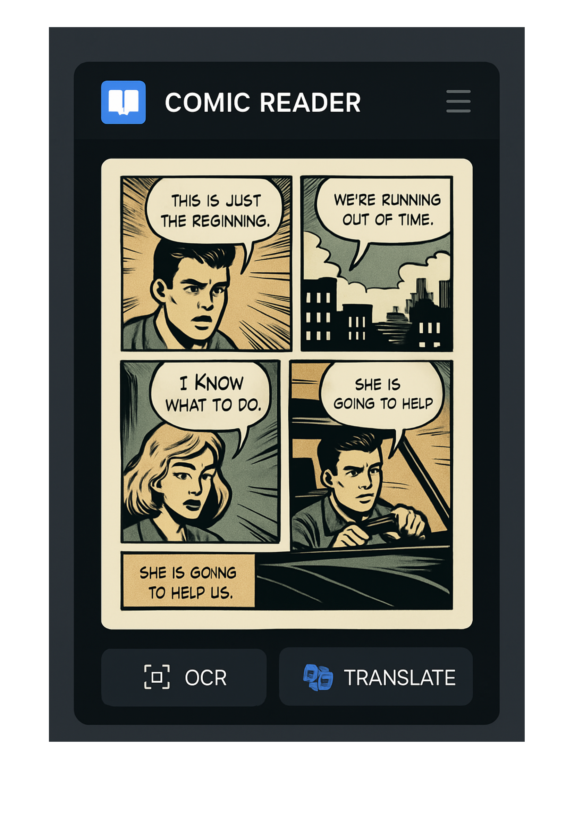
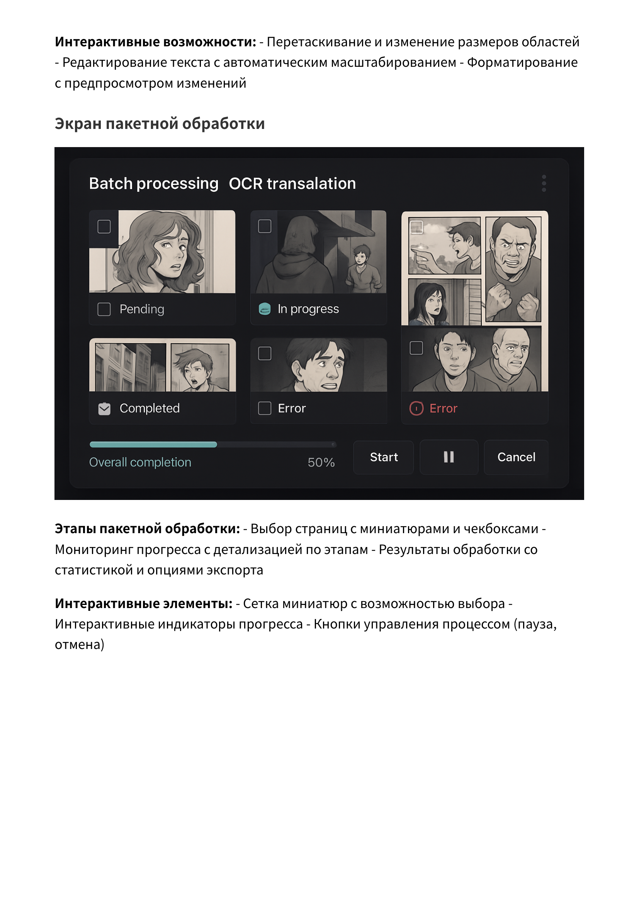

<p align="center">
  
</p>

# Mr.Comic


Mr.Comic - это мощное приложение для чтения комиксов на устройствах Android с расширенными возможностями OCR, перевода и плагинами.

<p align="center">
  
</p>

## Особенности

- **Поддержка различных форматов**: CBZ, CBR, PDF и другие популярные форматы комиксов
- **OCR и перевод**: Извлечение и перевод текста из комиксов на любой язык
- **Закладки и аннотации**: Отмечайте любимые страницы и добавляйте заметки
- **Облачная синхронизация**: Синхронизируйте библиотеку и прогресс чтения между устройствами
- **Система плагинов**: Расширяйте функциональность с помощью пользовательских плагинов
- **Настраиваемый интерфейс**: Адаптируйте опыт чтения под свои предпочтения

## Ключевые функции

### Сравнение оригинала и перевода
<p align="center">
  
</p>
Просматривайте оригинальный текст и перевод одновременно в режиме разделенного экрана.

### Пакетная обработка
<p align="center">
  
</p>
Обрабатывайте множество страниц комиксов одновременно с помощью OCR и перевода.

### Мобильный интерфейс
<p align="center">
  
</p>
Оптимизированный интерфейс для мобильных устройств с удобными элементами управления.

## Установка

1. Скачайте APK-файл Mr.Comic с [официального сайта](https://mrcomic.example.com) или Google Play Store
2. Откройте APK-файл на вашем Android-устройстве
3. Следуйте инструкциям на экране для завершения установки
4. Запустите Mr.Comic из списка приложений

## Дорожная карта проекта

Текущий статус разработки Mr.Comic по фазам:

### Фаза 1: Библиотека и импорт (60%)
- ✅ Базовая структура библиотеки
- ✅ Импорт комиксов (частично)
- ✅ Каталогизация (базовая)
- 🔄 Расширенная поддержка форматов (.cbz, .pdf, .epub, .cbr, .mobi)
- 🔄 Расширенная каталогизация (избранное, коллекции, история)
- 🔄 Распознавание и индексация метаданных

### Фаза 2: Навигация и структура чтения (40%)
- ✅ Базовый постраничный режим
- ✅ Простая навигация
- 🔄 Расширенные режимы чтения (непрерывная прокрутка, двухстраничный режим)
- 🔄 Улучшенная навигация (миниатюры, закладки, поиск)

### Фаза 3: Кастомизация интерфейса (80%)
- ✅ Система тем (светлая, тёмная, AMOLED)
- ✅ Базовые настройки шрифтов
- ✅ Профили настроек
- 🔄 Расширенные настройки интерфейса
- 🔄 Пользовательские темы

### Фаза 4: OCR и перевод (40%)
- ✅ Базовая архитектура для OCR и перевода
- ✅ Интеграция с некоторыми API перевода
- 🔄 Расширенная система OCR
- 🔄 Локальные модели перевода
- 🔄 Улучшенное распознавание речевых пузырей

### Фаза 5: Бэкап и синхронизация (10%)
- ✅ Базовое сохранение настроек
- 🔄 Система бэкапа
- 🔄 Облачная синхронизация
- 🔄 Синхронизация между устройствами

### Фаза 6: Аннотации и заметки (5%)
- ✅ Базовая структура для хранения заметок
- 🔄 Система текстовых аннотаций
- 🔄 Система графических аннотаций
- 🔄 Экспорт/импорт аннотаций

### Фаза 7: Темы сообщества и стор (70%)
- ✅ Платформа для обмена темами
- ✅ Базовый интерфейс для просмотра тем
- 🔄 Система рейтингов и отзывов
- 🔄 Улучшенный поиск и фильтрация

### Фаза 8: Система плагинов (30%)
- ✅ Базовая архитектура системы плагинов
- ✅ Прототипы некоторых плагинов
- 🔄 Расширенная система плагинов
- 🔄 Магазин плагинов
- 🔄 Система безопасности плагинов

### Фаза 9: Аналитика и обратная связь (10%)
- ✅ Базовый сбор логов
- 🔄 Система аналитики
- 🔄 Система обратной связи
- 🔄 Система отчетов об ошибках

### Фаза 10: Интеграция с Android (5%)
- ✅ Базовая интеграция с Android
- 🔄 Виджеты
- 🔄 Интеграция с системными функциями
- 🔄 Оптимизация для различных устройств

## Архитектура

Mr.Comic построен на модульной архитектуре, состоящей из следующих основных компонентов:

### 1. Основное ядро приложения
- Управление библиотекой комиксов
- Рендеринг и отображение страниц
- Навигация и пользовательский интерфейс

### 2. Модуль OCR и перевода
- Распознавание текста на изображениях
- Интеграция с API перевода
- Кэширование результатов для оптимизации
- Локальные модели перевода

### 3. Инструменты редактирования
- Редактор изображений
- Редактор текста
- Редактор макета

### 4. Система плагинов
- Динамическая загрузка плагинов
- Песочница безопасности для плагинов
- Управление жизненным циклом плагинов

### 5. Облачная синхронизация
- Синхронизация библиотеки
- Синхронизация прогресса чтения
- Синхронизация закладок и аннотаций
- Бэкап и восстановление

## Структура проекта

```
Mr.Comic/
├── app/                          # Основной код приложения
├── core/                         # Ядро приложения
├── mrcomic-api/                  # API для интеграции с внешними сервисами
├── mrcomic-ocr-translation/      # Модуль OCR и перевода
├── mrcomic-processing-pipeline/  # Конвейер обработки изображений
├── mrcomic-theme-client/         # Клиент для работы с темами
├── mrcomic-theme-platform/       # Платформа для обмена темами
├── plugins/                      # Система плагинов
│   ├── export-plugin/            # Плагин для экспорта
│   ├── gui/                      # Интерфейс управления плагинами
│   ├── image-filter-plugin/      # Плагин для фильтрации изображений
│   ├── security/                 # Механизмы безопасности плагинов
│   ├── text-editor-plugin/       # Плагин для редактирования текста
│   ├── tool-integration-plugin/  # Плагин для интеграции инструментов
├── src/                          # Исходный код
│   ├── annotations/              # Система аннотаций
│   ├── backup/                   # Система бэкапа
│   ├── features/                 # Основные функции
│   ├── ocr/                      # OCR функциональность
│   ├── sync/                     # Система синхронизации
│   ├── translation/              # Система перевода
│   ├── ui/                       # Пользовательский интерфейс
├── docs/                         # Документация
├── local_translation_models/     # Локальные модели перевода
├── themes_store/                 # Хранилище тем
├── backup/                       # Скрипты и примеры для бэкапа
├── scripts/                      # Скрипты для обучения, конвертации и CI/CD
```

## Система плагинов

Mr.Comic включает мощную систему плагинов, позволяющую расширять функциональность приложения. Плагины могут:

- Добавлять новые форматы комиксов
- Интегрироваться с внешними сервисами
- Предоставлять дополнительные инструменты редактирования
- Улучшать существующие функции

### Управление плагинами

Пользователи могут управлять плагинами через интерфейс управления плагинами:
- Установка новых плагинов
- Включение/отключение плагинов
- Настройка параметров плагинов
- Удаление плагинов

### Безопасность плагинов

Все плагины выполняются в изолированной среде с ограниченными разрешениями:
- Контроль доступа к файловой системе
- Ограничение сетевого доступа
- Ограничение выполнения кода
- Контроль использования ресурсов

## Интеграция OCR, перевода и редактирования

Mr.Comic обеспечивает бесшовную интеграцию между OCR, переводом и инструментами редактирования:

### OCREditorIntegration
- Обработка событий от редактора изображений и OCR процессора
- Кэширование результатов OCR для оптимизации производительности
- Поддержка предобработки изображений для улучшения качества OCR

### TranslationEditorIntegration
- Обработка событий от редактора текста и процессора перевода
- Кэширование результатов перевода для оптимизации производительности
- Поддержка словарей для специфических терминов комиксов

### UnifiedEditorInterface
- Переключение между режимами работы (OCR, перевод, редактирование)
- Управление процессами OCR и перевода
- Отображение прогресса обработки

## Документация

Подробная документация доступна в следующих форматах:

- [Руководство пользователя](docs/build/Mr.Comic_User_Manual.pdf)
- [API документация](docs/build/html/index.html)
- [Руководство по разработке плагинов](docs/build/html/plugins/index.html)

Для генерации документации:

```bash
cd docs
make html     # Генерация HTML документации
make pdf      # Генерация PDF документации
```

## Разработка

### Требования

- Android Studio 4.2+
- JDK 11+
- Gradle 7.0+

### Сборка проекта

```bash
# Клонирование репозитория
git clone https://github.com/Leostrange/Mr.Comic.git

# Переход в директорию проекта
cd Mr.Comic

# Сборка проекта
./gradlew build

# Создание APK
./gradlew assembleDebug
```

## Вклад в проект

Мы приветствуем вклады в проект Mr.Comic! Если вы хотите внести свой вклад:

1. Форкните репозиторий
2. Создайте ветку для вашей функции (`git checkout -b feature/amazing-feature`)
3. Внесите изменения и закоммитьте их (`git commit -m 'Add some amazing feature'`)
4. Отправьте изменения в ваш форк (`git push origin feature/amazing-feature`)
5. Откройте Pull Request

## Лицензия

Этот проект лицензирован под MIT License - см. файл [LICENSE](LICENSE) для подробностей.

## Контакты

- Веб-сайт: [https://mrcomic.example.com](https://mrcomic.example.com)
- Email: support@mrcomic.example.com
- GitHub: [https://github.com/Leostrange/Mr.Comic](https://github.com/Leostrange/Mr.Comic)

